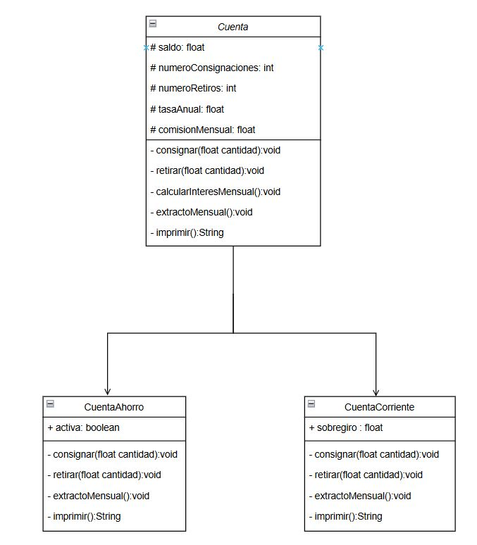

# Cuenta Bancaria - Implementación en Java

Este proyecto simula una cuenta bancaria con distintas características. La clase principal `Cuenta` permite realizar consignaciones y retiros, calcular intereses mensuales, y generar extractos. Existen dos clases hijas que extienden `Cuenta`: `CuentaAhorro` y `CuentaCorriente`, que agregan características y restricciones adicionales.

## Diagrama UML

## Tecnologías Utilizadas

- Java
- Spring Boot
- Maven
- JUnit y Hamcrest para pruebas.

